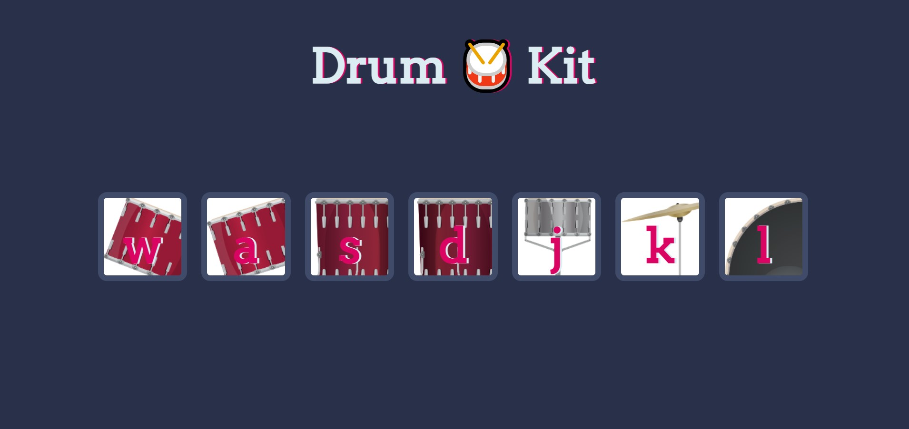

<h1>DRUM KIT</h1>

Experience the joy of drumming with our interactive drum kit, playable with the 'W', 'A', 'S', 'D', 'K', and 'L' keys. This kit includes 4 Tom-Toms, a Snare Drum, a Crash Cymbal, and a Bass Drum, each offering unique sounds for an exciting rhythmic experience. 

<h2> Software Languages </h2>

- HTML

- CSS

- JavaScript

<h2> Screen Image </h2>

